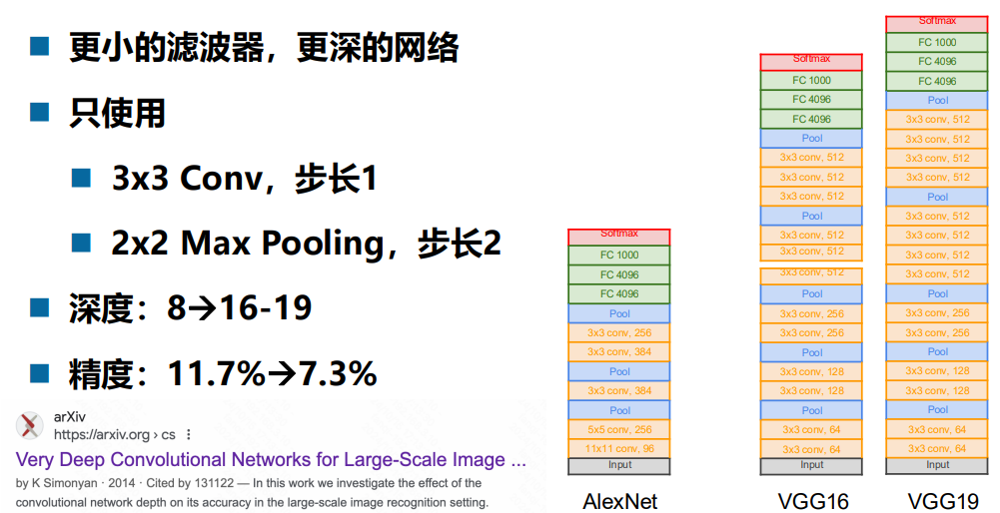

Deep Learning

以下是一些导致 NLP（自然语言处理）有着相对统一的模型 / 结构，而 CV（计算机视觉）没有的原因：

## ChatGPT

### 1. **输入数据的结构性差异**

- **NLP**: 自然语言具有高度的线性和离散性。语言本质上是一维序列（文本是一串词或字符），这种特性使得 NLP 的输入数据可以自然地适配 Transformer、RNN 等序列模型。
- **CV**: 图像数据是高度二维甚至三维的，像素点之间存在局部相关性和全局上下文关系，数据的维度和特性决定了不同任务可能需要不同的模型架构（如卷积网络、Transformer 等）。

------

### 2. **任务目标的多样性**

- **NLP**: 许多任务（如机器翻译、文本生成、问答系统）可以归结为序列到序列问题，因此可以采用统一的模型（如 Transformer）。
- **CV**: CV 涉及分类、目标检测、图像分割、三维重建等多种任务，每种任务的需求和挑战不尽相同，因此没有完全统一的模型结构。

------

### 3. **领域的复杂性**

- **NLP**: 自然语言的表达虽然复杂，但其基础单元（词或字符）较为固定，语义理解多依赖上下文关系。Transformer 的注意力机制非常适合建模这种上下文关系。
- **CV**: 图像的多样性和复杂性更高，不同分辨率、背景、光照等因素对模型的适配性提出了更高要求；例如，卷积神经网络（CNN）专注于局部特征提取，而 Vision Transformer 则更加依赖于全局信息建模。

------

### 4. **数据规模和标注成本**

- **NLP**: 大规模的语料库（如 Wikipedia）可以较低成本获取，模型能够通过无监督学习预训练（如 BERT、GPT）统一适配下游任务。
- **CV**: 图像标注成本高且专业性强，不同任务的数据需求差异较大，例如分类数据集（ImageNet）和分割数据集（COCO）结构完全不同，难以直接统一模型。

------

### 5. **Transformer 在两个领域的不同表现**

- Transformer 在 NLP 的成功激发了研究者尝试将其应用于 CV。近年来，Vision Transformer（ViT）和其变种正在推动 CV 向统一模型方向发展，但相比 NLP，其适应性仍在探索阶段。原因包括：
  - 图像分辨率较高，直接处理会导致计算量激增。
  - Transformer 在 CV 上需要引入额外的设计（如 Patch Embedding）以适配图像结构

## 豆包

### NLP 方面

- 数据的序列性和离散性

  - **序列性**：自然语言本质上是一种序列数据，单词或字符按照一定的顺序组成句子、段落和文本。这种序列性使得模型可以相对容易地采用统一的序列处理方式，如 Transformer 中的自注意力机制，能够很好地捕捉序列中元素之间的长距离依赖关系，并且这种机制在处理不同的 NLP 任务（如机器翻译、文本分类、情感分析等）时都具有一定的通用性。
  - **离散性**：自然语言的词汇量虽然庞大，但通常是离散的，并且可以通过词嵌入等技术将单词映射到一个固定维度的向量空间中。这种离散性和相对统一的表示方式使得模型可以在不同的 NLP 任务中共享相似的输入表示和处理流程。
  
- 任务的相似性和可迁移性

  - **任务相似性**：许多 NLP 任务都涉及到对文本的理解和生成，例如机器翻译是将一种语言的文本序列转换为另一种语言的文本序列，文本摘要则是对输入文本进行压缩和提炼生成摘要文本。这些任务在本质上有一定的相似性，都需要模型理解文本的语义、语法和上下文信息，因此可以基于相似的模型结构进行扩展和调整来适应不同任务。
- **可迁移性**：在 NLP 中，预训练模型（如 BERT、GPT 等）在大规模无标注文本上进行预训练后，通过微调等方式可以很好地迁移到各种下游任务中。这种预训练 - 微调的范式在 NLP 领域取得了巨大成功，进一步促进了统一模型结构的发展和应用，因为预训练模型的结构可以在不同任务中保持相对稳定，只需要针对具体任务进行少量的参数调整和优化。

### CV 方面

- 数据的多样性和复杂性

  - **多样性**：计算机视觉处理的数据包括图像和视频，图像的内容和形式非常多样化，涵盖了各种物体、场景、光照条件、视角等。视频则还涉及到时间维度的信息，如物体的运动、场景的变化等。不同类型的视觉任务（如图像分类、目标检测、图像分割、视频理解等）对数据的关注点和处理方式差异较大。例如，图像分类主要关注整体图像的类别，而目标检测需要同时定位和识别图像中的多个物体，这就导致很难有一种统一的模型结构能够同时高效地处理所有这些任务和数据的多样性。
  - **复杂性**：图像和视频数据具有高维度和丰富的空间结构信息。卷积神经网络（CNN）是 CV 中常用的模型，它通过卷积操作能够有效地提取图像的局部特征和空间层次结构，但对于一些需要全局信息和长距离依赖关系的任务，单纯的 CNN 可能不够，需要结合其他机制（如注意力机制等）。而不同的任务对局部和全局信息的需求程度不同，这也使得 CV 模型的结构更加多样化。
  
- 任务的特殊性和需求差异

  - **任务特殊性**：不同的 CV 任务具有各自独特的要求和挑战。例如，图像分割需要精确地划分出图像中每个像素所属的类别或物体，这就需要模型能够准确地捕捉像素级的细节和边界信息；而视频中的行为识别则需要模型能够理解物体在时间维度上的运动模式和行为语义。这些任务的特殊性导致了模型需要针对具体任务进行专门的设计和优化，难以形成像 NLP 中那样相对通用的模型结构。
- **需求差异**：在实际应用中，CV 任务的性能指标和应用场景也各不相同。例如，在自动驾驶中，目标检测的实时性和准确性至关重要，模型需要快速准确地检测出道路上的车辆、行人等物体；而在医学图像分析中，图像分割的精度和对细微病变的识别能力是关键，模型需要能够处理复杂的医学图像并准确地分割出病变区域。这些不同的需求促使研究人员开发出各种专门针对特定任务和应用场景的 CV 模型和结构。

综上所述，NLP 由于数据的序列性、离散性以及任务的相似性和可迁移性等特点，使得相对统一的模型结构能够在该领域广泛应用和发展；而 CV 由于数据的多样性、复杂性以及任务的特殊性和需求差异等因素，导致模型结构更加多样化，难以形成统一的模式。不过，随着深度学习技术的不断发展，CV 领域也在不断探索和借鉴 NLP 中的一些成功经验和方法，试图寻找更加通用和有效的模型架构和处理方式。

## lecture 1 绪论

**端到端**：end to end learning （输入一头猪，输出的是香肠）

​	模型可以直接利用输入数据而不需要其他处理

backbone负责特征提取，neck负责特征整合，head负责具体任务的执行

简化，data-direct；需要大量数据，可能排除有用的手工设计组件

好的表示：

​	具有很强的表示能力，即同样大小的向量可以表示更多信息

​	使后续的学习任务变得简单，即需要包含更高层的语义信息

​	具有一般性，是任务或领域独立的，可以迁移到其他任务上

学习好的表示

​	关键是构建具有一定深度的多层次特征表示

## lecture 2 图像分类

### 图像分类

问题：semantic gap

输入数据的底层特征和高层语义信息之间的不一致性和差异性

挑战：视角差异（viewpoint variation）

​	    光照变化（illumination）

​	    杂乱背景（background clutter)

​	    遮挡       （occlusion）

​	    形变        （deformation）

​	    类内差异（intra-class variation）

​	    类间相似（inter-class similarity）

​	    语义干扰（context disturbance）

data-driven 图像分类：

```python
def train(images,labels):
	#maching learning
    return model
def predict(model,test_images):
    #use model to predict
    return test_labels
```


### KNN

```python
class NearestNeighbor:
    def __init__(self):
        pass
    
    def train(self, X, y):
    self.Xtr = X
    self.ytr = y
    
    def predict(self, X):
        num_test = X.shape[0]
        Ypred = np.zeros(num_test, dtype=self.ytr.dtype)

        for i in range(num_test):
            distances = np.sum(np.abs(self.Xtr - X[i, :]), axis=1)#axis=1表示在沿着行方向上操作
            min_index = np.argmin(distances)
            Ypred[i] = self.ytr[min_index]

        return Ypred
```

时间复杂度：O(ND), N：样本数量，D：特征维度

如果K个近邻都是不同类：随机/加权voting

距离度量函数：

​	$l_1 distance :$ $ d_1(I_1,I_2)=\sum_p|I_1^p-I_2^p|$ 曼哈顿距离


$l_2 distance :d_2(I_1,I_2)=\sqrt{\sum_p (I_1^p-I_2^p)^2}$

###  线性分类器


​                               								图像像素平铺为一个向量 $x$

**只能处理线性可分**

**某些问题低维不可分**：映射到高维后进行分类

#### 训练线性分类器

loss function:$L=\frac{1}{N}\sum_iL_i(f(x_i,W),y_i)$

##### SVM Loss:

$s=f(x_i;W)$ 

$L_{i} & =\sum_{j \neq y_{i}}\left\{\begin{array}{ll}0 & \text { if } s_{y_{i}} \geq s_{j}+1 \\ s_{j}-s_{y_{i}}+1 & \text { otherwise }\end{array}\right. \\ & =\sum_{j \neq y_{i}} \max \left(0, s_{j}-s_{y_{i}}+1\right)$


若改为$L_i=\sum_{j\neq y_i}(\max(0,s_j-s_{y_i}+1))^2$，则会使得损失函数对离群点更加敏感，影响模型的泛化能力

若$s$很小，则会导致$\max(0,s_j-s_{y_i}+1)=\max(0,1)=1,L_i$等于不正确类别的数量

$SVM~~ Loss~~ Code$

```python
def L_i_vectorized(x,y,W):
    scores=W.dot(x)
    margins = np.maximum(0,scores - scores[y] + 1)
    margins[y] = 0
    loss_i = np.sum(margins)
    return loss_i
```
##### Softmax Loss：

$s=f(x_i;W) ~~~P(Y=k|X=x_i)=\frac{e^{s_k}}{\sum_je^{s_j}}$

$L_i=-logP(Y=y_i|X=x_i)=-log\frac{e^{s_{y_i}}}{\sum_je^{s_j}}$


$s_j$相等时，$Loss_i=log(c)$ $c$为类别的个数


## Lecture 3 正则化与优化

$W$使得$Loss$为$0$，$2W$也可以，如何选择？

### 正则化（regularization）

$L(W)=\frac{1}{N} \sum_{i=1}^{N} L_{i}\left(f\left(x_{i}, W\right), y_{i}\right)+\lambda R(W)$

模型损失：模型预测加过应与训练数据标签一致

正则化：避免过拟合

正则化：偏好简单的模型 

- 降低模型对训练数据的过拟合
- 降低训练噪声对模型的影响

奥卡姆剃刀原则：($Occam's Razor$)

​	如无必要，勿增实体（Among multiple competing  hypotheses, the simplest is the best）

常见:
$$
l_2~regularization~~~R(W)=\sum_{k} \sum_{l} W_{k, l}^{2}
\\
l_1~regularization~~~R(W)=\sum_{k} \sum_{l}\left|W_{k, l}\right|
\\ 
Elastic~net (l_1+l_2)R(W)=\sum_{k} \sum_{l} \beta W_{k, l}^{2}+\left|W_{k, l}\right|
$$
other:Dropout，Batch normalization， Stochastic depth, fractional pooling etc.

$l_2$偏好“分散”的权重


### 优化 （optimization）

$\theta^{\star} \leftarrow \arg \min _{\theta}\underbrace{-\sum_{i} \log p_{\theta}\left(y_{i} \mid x_{i}\right)}_{\mathcal{L}(\theta)}$

找到一个方向$v$使得损失$\mathcal{L}(\boldsymbol{\theta})$降低

$\theta \leftarrow \theta+\alpha v$

梯度下降

$Code:$

```python
while True:
    weights_grad = evaluate_gradient(loss_fun, data, weights)
    weights += - step_size * weights_grad  # perform parameter update
    #step_size: 学习率
```


#### SGD (Stochastic Gradient Descent) 随机梯度下降

$SGD:$

$L(W)=\frac{1}{N} \sum_{i=1}^{N} L_{i}\left(x_{i}, y_{i}, W\right)+\lambda R(W)$

$Mini-batch~Gradient~Descent:$

$\nabla_{W} L(W)=\frac{1}{N} \sum_{i=1}^{N} \nabla_{W} L_{i}\left(x_{i}, y_{i}, W\right)+\lambda \nabla_{W} R(W)$

```python
# mini-batch
while True:
    data_batch = sample_training_data(data, 256)  # 采样256个样本
    weights_grad = evaluate_gradient(loss_fun, data_batch, weights)
    weights += - step_size * weights_grad  # 更新参数
```


$SGD-Problem1:$优化方向不是最优

$SGD-Problem2:$遇到局部最优值或鞍点

##### SGD- 遇到局部最优值或鞍点

**局部最优值（$local optimum$）:**

- 此处梯度为 0，理论上可怕（非凸损失函数）

- 实际上，随着网络参数量的增加，这个问题的影响会很小 
- 对于大型网络，局部最优值通常与全局最优值很接近

**鞍点（$saddle point$）：**

梯度很小或为0，在部分方向上为最大值，部分方向上为最小值

**区分**：损失函数的$ Hessian $矩阵的特征值 

- 鞍点：$Hessian$ 矩阵的特征值有正也有负
- 局部最优值：$Hessian$ 矩阵的特征值全部为正或全部为负


##### SGD- 方向优化

###### SGD

$x_{t+1}=x_{t}-\alpha \nabla f\left(x_{t}\right)$

```python
while True:
    dx = compute_gradient(x)
    x -= learning_rate * dx
```

###### SGDM(SGD+Momentum)

$v_{t+1} =\rho v_{t}+\nabla f\left(x_{t}\right)$
$x_{t+1} =x_{t}-\alpha v_{t+1}$

```python
vx = 0
while True:
    dx = compute_gradient(x)
    vx = rho * vx + dx
    x -= learning_rate * vx
    #roh一般为0.9或0.99
```

- 如果本次和上次的梯度符号是相同的，那么就能够加速下降（幅度变大），就能够解决原先下降太慢的问题；如果本次和上次的梯度符号是相反的，那么这次就和上次相互抑制，减缓震荡。

- 由于有动量的作用，在局部最优点时，它可以借助动量跳出来，不易陷入局部最优点。


###### RMSProp (Root Mean Squard Propagation)

RMSProp 是为了解决优化过程中 **学习率难以调节** 的问题而提出的。特别是在深度学习中，梯度可能在不同方向上变化剧烈，固定学习率的梯度下降可能导致： 

- **梯度较大方向**：步长过大，优化过程不稳定，甚至发散。 

- **梯度较小方向**：步长过小，收敛速度过慢。

对每个维度的梯度大小进行“归一化”

$s_{t+1} = \rho s_{t} + (1 - \rho) \nabla f(x_t)^2$

$x_{t+1} = x_t - \frac{\alpha}{\sqrt{s_{t+1}} + \epsilon} \nabla f(x_t)$

$\rho : decay$ _ $rate $ 衰变率

```python
grad_squared = 0
while True:
    dx = compute_gradient(x)
    grad_squared = decay_rate * grad_squared + (1 - decay_rate) * dx * dx
    x -= learning_rate * dx / (np.sqrt(grad_squared) + 1e-7)
```

what RMSProp do?

自适应调整学习率

- 沿着“陡峭”方向的优化变慢
- 沿着“平缓”方向的优化加快

解决了AdaGrad学习率逐渐下降至消失的问题

更适合深度学习（以及**大多数非凸问题**）

**缺点：**

- 超参数依赖，比较依赖衰减因子等超参数的选择
- 可能不适合所有问题


###### AdaGrad (Adaptive Gradient Algorithm)

$ G_{t+1} = G_t + \nabla f(x_t)^2$

$x_{t+1} = x_t - \frac{\alpha}{\sqrt{G_{t+1} }+ \epsilon} \nabla f(x_t)   $

$\epsilon:$防止分母为零的一个很小的数

```python
grad_squared = 0
while True:
    dx = compute_gradient(x)
    grad_squared += dx * dx
    x -= learning_rate * dx / (np.sqrt(grad_squared) + 1e-7)
```

更适合解决**凸优化**问题:

- 学习率会随着时间的推移而有效地降低
- 由于不断在分母中快速累计梯度，导致学习率不断变小，因 此需要在学习率快速衰减之前找到最优值


- **适应稀疏数据**：通过累积梯度平方，学习率在稀疏方向更大，在频繁方向更小。 

- **高维问题有效**：对高维稀疏特征优化表现优秀。

**缺点：** 

- **学习率逐步减小**：梯度平方累积值不断增加，导致学习率单调减小，可能在训练后期停止学习。 
- **不适合深度学习**：对非平稳目标函数的表现不佳，训练深度神经网络时容易陷入局部最优。


###### Adam (Adaptive Moment Estimation)

idea: 

- 结合Momentum和RMSProp

Momentum提供了梯度方向的加速，使优化过程加快

RMSProp动态调整学习率，适应不同参数的梯度变化

- 加上Bias correction
- 注：标准Adam在计算梯度时加上L2 Regularization

​               AdamW 在最后计算x加上Weight Decay

$m_{t+1} = \beta_1 m_t + (1 - \beta_1) \nabla f(x_t)$

$v_{t+1} = \beta_2 v_t + (1 - \beta_2) \nabla f(x_t)^2$

$\hat{m}_{t+1} = \frac{m_{t+1}}{1 - \beta_1^{t+1}}, \quad \hat{v}_{t+1} = \frac{v_{t+1}}{1 - \beta_2^{t+1}}$

$x_{t+1} = x_t - \frac{\alpha}{\sqrt{\hat{v}_{t+1}} + \epsilon} \hat{m}_{t+1}$


```python
first_moment = 0
second_moment = 0
while True:
    dx = compute_gradient(x)
    ## Momentum
    first_moment = beta1 * first_moment + (1 - beta1) * dx
    ##
   
    ## RMSProp
    second_moment = beta2 * second_moment + (1 - beta2) * dx * dx
    x -= learning_rate * first_moment / (np.sqrt(second_moment) + 1e-7)
    ##
```


作用： 
- **自适应学习率**：通过结合一阶和二阶矩估计动态调整学习率
- **快速收敛**：Momentum 加速了梯度下降过程。
-  **稳定优化**：RMSProp 部分减少了梯度震荡，特别是在非平稳目标函数中表现优秀
-  **适合深度学习**：尤其适用于大型神经网络和稀疏梯度问题。

优点： 
- **兼顾速度和稳定性**：结合 Momentum 和 RMSProp 的优点，使得收敛速度快且优化过程平稳
-  **偏差校正**：提高了优化过程在初始阶段的效率

对 m k m_km k的偏差校正： 初始时刻，一阶矩 m k m_km k的值偏小，因为它是梯度值的加权平均，起始所有梯度都被初始化为 0。通过除以 1 − β 1 k 1 - \beta_1^k1−β 1k ，可以将 m k m_km k  的值放大，使其更快地接近实际的梯度均值。随着迭代次数 k kk的增加，β 1 k \beta_1^kβ 1k会趋向于 0，偏差校正因子 1 − β 1 k 1 - \beta_1^k1−β 1k 就会趋向于 1，偏差校正的影响会逐渐减小。对 v k v_kv k的偏差校正： 类似地，二阶矩 v k v_kv k（梯度平方的加权平均）也会在初始阶段被低估。通过除以 1 − β 2 k 1 - \beta_2^k1−β 2k ，可以增加 v k v_kv k

 的值，使其更接近实际的梯度平方的均值。随着 k kk 的增加，偏差校正因子 1 − β 2 k 1 - \beta_2^k1−β 2k 也会趋向于 1。


- **鲁棒性**：适用于不同类型的数据和网络结构

缺点： 
- **超参数敏感**：需要调节 $\alpha$、$\beta_1$、$\beta_2$ 等超参数，默认值并不总是适用
- **可能过拟合**：在某些问题中，Adam 的适应性可能导致过拟合
- **收敛性问题**：理论上 Adam 不总是收敛，后续有改进方法（如 AMSGrad）


#### 学习率（learning rate）

随时间变化：训练固定数量的epoch后降低学习率

ResNet 在第 30、60、90个 训练 epoch 时，将 lr 乘以0.1

**Cosine**: $\alpha_t=\frac{1}{2}\alpha_0(1+cos(t\pi/T))$

​	$\alpha_t$: t epoch时lr

​	T:total number of epochs

**Linear:** $\alpha_t=\alpha_0(1-t/T)$

**Inverse:**$\alpha_t=\alpha_0/\sqrt{t}$

一阶优化

二阶优化

拟牛顿法BGFS

L-BGFS

## lecture 4 神经网络和反向传播

### 神经网络

去掉激活函数：神经网络$\rightarrow$线性分类器

输出以 0 为中心的好处？ 模型训练收敛更快

##### 激活函数<a id="hello"></a>

**Sigmod：   $\frac{1}{1+e^{-x}}$**

- 输出值在 0 到 1 之间，这使其天然适用于将任意实数映射到概率。

  **平滑性**：函数曲线平滑，导数容易计算。

  **导数形式**：$y'=y(1-y)$。

- 作用

  - 概率估计：常用于二分类问题的输出层，作为预测概率。
  - 历史应用：在早期神经网络中广泛使用，但由于其存在梯度消失问题，现在使用较少。
  
- **问题**：

  - 梯度消失问题
  - 输出不以0为中心
  - 指数函数计算成本高

**tanh:    $\frac{e^x-e^{-x}}{e^x+e^{-x}}$**

- **值域**：输出值在 - 1 到 1 之间，相比于 Sigmoid，它的输出是以 0 为中心的。

  **平滑性**：函数曲线平滑，导数容易计算。

  **导数形式**：$y'=1-y^2$。

- 作用

  - **特征变换**：通常用于隐藏层，能够将输入数据变换到 - 1 到 1 之间，有助于数据的中心化。
- **问题**：虽然比 Sigmoid 有所改善，但在深层网络中仍可能出现梯度消失问题（饱和时）。

**ReLU: $\max(0~,x)$**

- **计算简单**：只需比较输入和 0 的大小，计算效率高。

  **稀疏性**：对于负输入，输出为 0，能够产生稀疏的激活，有助于减少参数之间的相互依赖。

  **导数形式**：当$x>0$时，$y'=1$；当$x<=0$时，$y'=0$。

- 作用：

  - **缓解梯度消失**：在正区间梯度为常数 1，有助于缓解梯度消失问题，加速训练。
  - **广泛应用**：目前在深度学习中应用非常广泛，尤其是在卷积神经网络（CNN）中。
  
- 问题：

	-  输出不以0为中心
	-  负数区域梯度为0（神经元死掉）

**Leaky ReLU:   $\max(0.1x,x)$**

- **解决 “死亡 ReLU” 问题**：对负输入有一个小的斜率（这里是 0.1），避免了 ReLU 中可能出现的神经元 “死亡”（即永远不会被激活）的问题。

  **导数形式**：。

- 作用：

  - **改进的激活函数**：作为 ReLU 的改进版本，在某些情况下可以取得更好的训练效果。

Maxout:   $\max(w_1^Tx+b_1,w_2^Tx+b_2)$

- 特点：
  - **分段线性**：它是一种分段线性函数，能够拟合任意的凸函数。
  - **无饱和区域**：不存在饱和区域，理论上可以避免梯度消失问题。
  - **参数数量多**：由于每个神经元都有多个线性函数，参数数量较多。
- 作用：
  - **灵活拟合**：能够灵活地拟合各种复杂的函数关系，在一些复杂的任务中可能有较好的表现。

ELU:    $x,x>=0; \alpha(e^x-1),x<0$

- 特点：
  - **负值处理**：对于负输入有一个非零的输出，有助于缓解神经元 “死亡” 问题。
  - **平滑性**：在处连续且平滑。
  - **导数形式**：当时，；当时，。
- 作用：
  - **改进的非线性**：结合了 ReLU 的优点，同时在负区域有更好的表现，有助于加速训练和提高模型性能。

```
W.dot(x)
np.dot(W,x)
```

```python
# forward - pass of a 3 - layer neural network:
# 三层神经网络的前向传播：

f = lambda x: 1.0 / (1.0 + np.exp(-x))  
# activation function (use sigmoid)
# 激活函数（使用sigmoid）

x = np.random.randn(3, 1)  
# random input vector of three numbers (3x1)
# 三个随机数组成的输入向量（3x1）

h1 = f(np.dot(W1, x) + b1)  
# calculate first hidden layer activations (4x1)
# 计算第一层隐藏层的激活值（4x1）

h2 = f(np.dot(W2, h1) + b2)  
# calculate second hidden layer activations (4x1)
# 计算第二层隐藏层的激活值（4x1）

out = np.dot(W3, h2) + b3  
# output neuron (1x1)
# 输出神经元（1x1）
```

```python
#训练2层神经网络
import numpy as np
from numpy.random import randn

N, D_in, H, D_out = 64, 1000, 100, 10
x, y = randn(N, D_in), randn(N, D_out)
w1, w2 = randn(D_in, H), randn(H, D_out)

for t in range(2000):
    #前向传播
    h = 1 / (1 + np.exp(-x.dot(w1)))
	y_pred = h.dot(w2)
    loss = np.square(y_pred - y).sum()#计算损失S
	print(t, loss)
    #反向传播
    grad_y_pred = 2.0 * (y_pred - y)
    grad_w2 = h.T.dot(grad_y_pred)
    grad_h = grad_y_pred.dot(w2.T)
    grad_w1 = x.T.dot(grad_h * h * (1 - h))
    #更新权重
    w1 -= 1e-4 * grad_w1
	w2 -= 1e-4 * grad_w2
```


### 反向传播

上游梯度 $\frac{\partial L}{\partial z}$

局部梯度 $\frac{\partial z}{\partial x}$ $\frac{\partial z}{\partial y}$

$\rightarrow $下游梯度 $\frac{\partial L}{\partial x}=\frac{\partial L}{\partial z}\frac{\partial z}{\partial x}$ $\frac{\partial L}{\partial y}=\frac{\partial L}{\partial z}\frac{\partial z}{\partial y}$

梯度流中的基本计算模式


模块化实现


#### 向量的反向传播


#### 矩阵的反向传播


## lecture 5 卷积神经网络（Convolutional Neural Networks) 

##### 图像浅层特征
1.浅层特征：浅层网络提取的特征和输入比较近，包含更多的像素点的信息，一些细粒度的信息是图像的一些颜色、纹理、边缘、棱角信息。
2.原理：浅层网络感受野较小，感受野重叠区域也较小，所以保证网络捕获更多细节。

3.优缺点：分辨率更高，包含更多位置、细节信息，但是由于经过的卷积更少，其语义性更低，噪声更多。

#### 图像深层特征
1.高层信息：深层网络提取的特征离输出较近，一些粗粒度的信息，包含是更抽象的信息，即语义信息
2.原理：感受野增加，感受野之间重叠区域增加，图像信息进行压缩，获取的是图像整体性的一些信息

3.优缺点：具有更强的语义信息，但是分辨率很低，对细节的感知能力较差。

### 卷积层 （conv）


**输出** $=（N+2P-F）/S+1$

如果要保持卷积后的尺寸相同 ，零填充为$(F-1)/2$ （conv 步长为1）

**参数量** = $(F\times F\times C_{in}+1(Bias) )\times C_{out}$

**感受野**：
$$
r_0=1\\
r_{i+1}=r_i+(k-1)\prod_{j=1}^{i-1} s_{j}\\
卷积层与池化层的计算公式，全连接层两层之间不变\\
r_{0}=\sum_{l=1}^{L}\left(\left(k_{l}-1\right) \prod_{i=1}^{l-1} s_{i}\right)+1
$$


### 池化层（pooling）

**参数量：0**

### 全连接层（FC）

### 不同类型卷积

#### 1$\times$1卷积

卷积核大小为$1\times1$

作用：

- **线性变换**：$H\times W \rightarrow^{1\times1}H\times W $通过激活函数实现（非）线性组合，实现信息融合
- **降低/提升 通道数** :$C_{in}\rightarrow C_{out}$

ResNet中3*3卷积层前后都使用了这种结构

#### 3D卷积

用于视频分类

#### 转置卷积


尽管它被称作转置卷积, 但是这并不意味着我们是拿一个已有的卷积矩阵的转置来作为权重矩阵的来进行转置卷积操作的. 和普通卷积相比,intput和output的关系被反向处理(转置卷积是1对多,而不是普通的多对1),才是转置卷积的本质.

**警告**:转置卷积会在生成的图像中造成棋盘效应(checkerboard artifacts).本文推荐在使用转置卷积进行上采样操作之后再过一个普通的卷积来减轻此类问题.如果你主要关心如何生成没有棋盘效应的图像,需要读一读paper.

#### 空洞卷积


加入空洞之后的实际卷积核尺寸与原始卷积核尺寸之间的关系：

$K = k + (k-1)(a-1)$

$k$为原始卷积核大小，$a$为卷积扩张率$(dilation rate)$

**效果**：增大感受野


#### 分组卷积

#### 可分离卷积

#### 可变形卷积

## lecture 6 卷积神经网络架构

神经网络具有尺度不变性

**尺度不变性(Scale Invariance)：** 如果一个机器学习算法在缩放全部或部分特征后不影响其学习和预测，那么称其具有尺度不变性，否则为尺度敏感的。线性分类器是尺度不变的，而最近邻分类器就是尺度敏感的。

### BN批归一化层(Batch Normalization)

以下输入会导致网络难以优化： 

- 输入不以零为中心（有较大的偏置） 

-  输入的每个元素具有不同的缩放比例 

解决方案:

- 对输入进行缩放（归一化)


$\epsilon$ : 防止分母为0

可学习的缩放和偏移参数： $\gamma,\beta:D$

使深度网络更容易训练

- 改善梯度流
- 允许更高的学习率，更快的收敛
- 网络对初始化变得更加稳健
- 在训练过程中起到正则化的作用
- 注意：训练和测试是不同的

### LeNet

yanh lecun发明

第一个卷积神经网络

识别手写数字，大量应用于银行系统

### AlexNet


注意的一点：原图输入224 × 224，实际上进行了随机裁剪，实际大小为227 × 227。

**贡献**：

- **ReLU激活函数的引入**

    采用修正线性单元(ReLU)的深度卷积神经网络训练时间比等价的tanh单元要快几倍。而时间开销是进行模型训练过程中很重要的考量因素之一。同时，ReLU有效防止了过拟合现象的出现。由于ReLU激活函数的高效性与实用性，使得它在深度学习框架中占有重要地位。

- **层叠池化操作**

    以往池化的大小PoolingSize与步长stride一般是相等的，例如：图像大小为256*256，PoolingSize=2×2，stride=2，这样可以使图像或是FeatureMap大小缩小一倍变为128，此时池化过程没有发生层叠。但是AlexNet采用了层叠池化操作，即PoolingSize > stride。这种操作非常像卷积操作，可以使相邻像素间产生信息交互和保留必要的联系。论文中也证明，此操作可以有效防止过拟合的发生。

- **Dropout操作 (FC6 FC7)**

    Dropout操作会将概率小于0.5的每个隐层神经元的输出设为0，即去掉了一些神经节点，达到防止过拟合。那些“失活的”神经元不再进行前向传播并且不参与反向传播。这个技术减少了复杂的神经元之间的相互影响。在论文中，也验证了此方法的有效性。

- **网络层数的增加**

    与原始的LeNet相比，AlexNet网络结构更深，LeNet为5层，AlexNet为8层。在随后的神经网络发展过程中，AlexNet逐渐让研究人员认识到网络深度对性能的巨大影响。当然，这种思考的重要节点出现在VGG网络，但是很显然从AlexNet为起点就已经开始了这项工作。

### VGGNet 更深的CNN



**为什么使用 3$\times$3 Conv？**

3个3$\times$3 Conv相对一个7$\times$7 Conv（同理：2个3$\times$3 Conv对应一个5$\times$ Conv）

- 相同的感受野
- 更少的参数量


显存占用瓶颈

参数量瓶颈

VGG（Visual Geometry Group）网络是由牛津大学 VGG 研究组提出的一种卷积神经网络结构，最初应用于 2014 年 ImageNet 图像分类挑战赛（ILSVRC）。VGG 网络的设计简单但效果显著，是计算机视觉中经典的深度卷积网络模型之一。

以下是 VGG 网络的主要贡献和意义：
**1. 模块化设计思想**

- **贡献**： VGG 引入了一种模块化设计理念，即使用 **连续的小卷积核（3×3）堆叠** 来代替大卷积核（如 5×5 或 7×7）。

- 原因：

  - 更深的网络结构可以增加非线性表达能力。
  - 使用多个 3×3 卷积层可以实现与较大卷积核类似的感受野，同时计算代价更低。

- 效果：

  - 通过多个小卷积核组合，提取更加细粒度的特征。
  - 减少参数数量（相比直接使用大卷积核），降低了计算复杂度。
 **2. 深层卷积网络设计**

- **贡献**： VGG 系列网络通过层数的增加（如 VGG-11、VGG-16、VGG-19），研究了网络深度对性能的影响，证明了网络深度的增加在一定范围内能够提升模型性能。

- **原因**： 深层网络能够更好地学习复杂的特征表达。

- 效果：

  - 比较浅层网络，深层 VGG 模型在分类精度上有显著提高。
  - 为后续深度神经网络的设计（如 ResNet）奠定了理论基础。
 **3. 网络结构的简单性**

- **贡献**： VGG 的网络结构简单而直观，采用一系列标准化的卷积、池化层堆叠，避免了不必要的复杂设计。

- 原因：

  - 保证结构通用性，便于后续模型的研究和迁移。

- 效果

  ：

  - 结构简单但有效，易于实现并扩展到其他任务（如目标检测、语义分割等）。
  - 成为深度学习研究和实践中的经典网络结构。


**4. 深度特征在迁移学习中的重要性**

- **贡献**： VGG 提供了基于大规模数据集（ImageNet）预训练的深度特征，表明这些特征可以迁移到其他计算机视觉任务中（例如目标检测、特征提取）。

- **原因**： 深层卷积网络学到的通用特征可以适配不同的下游任务。

- 效果：

  - 预训练的 VGG 模型成为迁移学习的典范。
  - 在许多任务上展现出优越的性能（例如 SIFTFlow、Pascal VOC 数据集）。


**5. 推动后续深度学习发展**

- **贡献**： VGG 的成功激发了对更深层神经网络的探索（如 ResNet、DenseNet）。

- 原因 ：

  - 证明了深度网络的重要性，但也暴露了深度增加带来的梯度消失和训练困难问题。

- 效果：
- VGG 是深度学习发展的重要里程碑，启发了后续对残差网络（ResNet）的设计，以解决深层网络中的优化问题。

 **6. 系统化评估卷积网络性能**

- **贡献**： VGG 系统地研究了网络深度（层数）与性能之间的关系。

- 原因 ：

  - 探索不同深度模型在同一任务上的表现差异。

- 效果 ：

  - 提供了从 VGG-11 到 VGG-19 的不同深度模型，为研究人员提供了丰富的参考模型。


 **VGG 的不足之处**

虽然 VGG 在卷积神经网络的研究中具有重要贡献，但它也存在以下缺点：

1. 参数量巨大

   - VGG-16 有约 1.38 亿个参数，存储和计算成本较高。

2. 计算效率低

   - 多层堆叠的 3×3 卷积核虽然提升了性能，但计算效率较低。

3. 未解决梯度消失问题


   - 随着网络的加深，仍然存在梯度消失的风险。

4. 难以适应移动设备


   - 模型规模较大，不适合低算力设备。

**总结**

VGG 网络通过小卷积核堆叠和深层结构设计，在图像分类任务中取得了显著效果，并推动了深度学习网络的发展。尽管在计算效率和参数量上存在不足，但它为后续网络设计提供了重要启发，如模块化思想、深度学习的通用特征迁移等。

### GoogLeNet（更深）


#### Inception 模块

简单的 Inception：并联多个不同的算子 

- 问题一：计算量和参数量太大
- 问题二：通道数持续变大

solution：使用1x1 Conv 降低计算量、参数量、通道数


这里的辅助分类器只是在训练时使用，在正常预测时会被去掉。辅助分类器促进了更稳定的学习和更好的收敛，往往在接近训练结束时，辅助分支网络开始超越没有任何分支的网络的准确性，达到了更高的水平。

### ResNet

核心：

Residual block


## lecture 7 训练神经网络

### 激活函数

[见lecture 4部分](#hello)

### 数据预处理

假设输入图像大小为[32, 32, 3] 

- 输入图像减去数据集中的平均图像（[32, 32, 3]）（AlexNet）

- 输入图像减去每个通道的均值（[1, 1, 3]）（VGGNet） 
- 输入图像减去每个通道的均值（[1, 1, 3]），除以每个通道的标准差（[1, 1, 3]）（现在最常用的方法）

### 权重初始化

初始化为0，（X）relu为激活函数，第一层开始输出就为0

随机分布初始化：relu ：前几层还行，后面又变成0


Xavier initialization：

- Xavier 初始化的基本思想是保持网络中每层输入和输出的方差在训练过程中尽量保持一致，从而避免梯度消失或梯度爆炸问题，加快训练速度。

std=1/sqrt（Din）对于卷积，Din（Dimension of input）是filter_size（卷积核尺寸）^2 *input_channels（输入通道数）

- Xavier 初始化适用于激活函数是线性的，或者激活函数关于零点对称且在零点附近近似线性的情况，例如 tanh 函数和 softsign 函数等。因为这些激活函数在零点附近的梯度比较稳定，与 Xavier 初始化的假设较为匹配。

Kaiming Initialization：本质 高斯分布初始化

- Kaiming 初始化是针对 ReLU（Rectified Linear Unit）激活函数及其变体（如 Leaky ReLU 等）提出的初始化方法。ReLU 激活函数在正半轴的梯度为 1，负半轴的梯度为 0，这种非对称性使得 Xavier 初始化不再适用。

- Kaiming 初始化主要适用于使用 ReLU 及其变体作为激活函数的网络，如卷积神经网络（CNN）等。在这些网络中，ReLU 激活函数被广泛使用，Kaiming 初始化能够更好地适应其特性，提高网络的训练效果和性能。

### 正则化

#### Dropout

在模型训练的每次向前传播计算中，将一些神经元随机设置为零 

随机概率是一个超参数，常用 0.5


 如果测试时也使用 dropout，模型的输出会有随机性

-  测试时，我们想要求随机性的期望 作为确定的输出


dropout 可以看作模型集成

- dropout 训练了大量参数共享的模型
- 每次的随机掩码都对应了一个模型

#### Stochastic Depth

训练时随即跳过某些层

测试时使用所有层

#### 数据增强

图像变换

**水平翻转**

**随即裁剪和缩放**

**颜色扰动**

#### Cutout

随机将若干个矩形区域删除（像素值改成0）

小数据集上效果好，大数据集上不常用

#### Mixup

训练时随机将多张图片混合为一张图片

测试时使用原始图像


### 超参数选择

- 第一步：检查初始损失（关闭权重衰减）
- 第二步：过拟合少量样本
- 第三步：选择合适的 LR
-  第四步：粗调 1-5 epochs
- 第五步：精调 10-20 epochs（从第四步选择最好的模型）
- 第六步：检查损失和准确率曲线

accuracy持续上升需要训练更多轮次

train-val 曲线：

gap大：过拟合，需要增加正则化/数据

gap小：欠拟合

参数搜索方法：
**Grid Layout**

- **原理**：通过在预先设定的参数范围内，按照一定的步长和顺序，遍历所有可能的参数组合。例如，对于重要参数，可能从最小值开始，以固定的间隔（如 0.1）逐步增加到最大值；对于不重要参数也类似。
- **优点**：
  - 能够全面地覆盖参数空间，不会遗漏任何一个网格点上的参数组合，确保了一定的完整性。
  - 如果参数空间的维度较低（例如只有 2 或 3 个参数），并且计算资源充足，这种方法可以较为系统地找到最优参数组合附近的区域。
- **缺点**：
  - 当参数空间维度较高时（例如超过 3 个参数），需要搜索的参数组合数量会呈指数级增长，导致计算成本极高，甚至在实际中不可行。
  - 可能会在一些不重要的区域浪费大量的计算资源，因为即使在这些区域进行了密集的搜索，也不一定能找到更好的模型性能。

**Random Layout**

- **原理**：在给定的参数范围内，随机生成一定数量的参数组合。每次生成的参数值都是随机的，不受之前生成的参数组合的影响。
- **优点**：
  - 相比网格布局，随机布局在高维参数空间中更加高效。因为不需要像网格布局那样遍历所有可能的组合，而是通过随机抽样的方式探索参数空间，大大减少了计算量。
  - 有可能通过较少的搜索次数找到性能较好的参数组合，尤其是当最优参数组合位于一些不规则的区域时，随机布局可能会偶然地找到这些区域，而网格布局可能会错过。
- **缺点**：
  - 由于是随机搜索，不能保证覆盖到所有的重要区域，可能会错过一些潜在的最优参数组合。
  - 结果的可重复性较差，即每次运行随机搜索可能会得到不同的最优参数组合，因为搜索过程是随机的。


## lecture 8 循环神经网络（RNN）

### RNN


隐藏状态更新：

$h_t=f_W(h_{t-1},x_t)$

$y_t=f_{W_{hy}}(h_t)$

核心思想：

$h_t=f_W(h_{t-1},x_t)$

$h_t=tanh(W_{hh}h_{t-1}+W_{xh}x_t)$

$y_t=W_{hy}h_t$


**RNN的梯度计算**


$$
\begin{aligned} h_{t} & =\tanh \left(W_{h h} h_{t-1}+W_{x h} x_{t}\right) \\ & =\tanh \left(\left(\begin{array}{ll}W_{h h} & W_{h x}\end{array}\right)\binom{h_{t-1}}{x_{t}}\right) \\ & =\tanh \left(W\binom{h_{t-1}}{x_{t}}\right)\end{aligned}
$$

$$
\begin{array}{l}\frac{\partial L}{\partial W}=\sum_{t=1}^{T} \frac{\partial L_{t}}{\partial W}  \\ \frac{\partial L_{T}}{\partial W}=\frac{\partial L_{T}}{\partial h_{T}} \frac{\partial h_{t}}{\partial h_{t-1}} \ldots \frac{\partial h_{1}}{\partial W}=\frac{\partial L_{T}}{\partial h_{T}}\left(\prod_{t=2}^{T} \frac{\partial h_{t}}{\partial h_{t-1}}\right) \frac{\partial h_{1}}{\partial W}\\
\frac{\partial h_{t}}{\partial h_{t-1}}=\tanh ^{\prime}\left(W_{h h} h_{t-1}+W_{x h} x_{t}\right) W_{h h}\\
\frac{\partial L_{T}}{\partial W}=\frac{\partial L_{T}}{\partial h_{T}}\left(\prod_{t=2}^{T} \tanh ^{\prime}\left(W_{h h} h_{t-1}+W_{x h} x_{t}\right)\right) W_{h h}^{T-1} \frac{\partial h_{1}}{\partial W}\end{array}
$$

梯度消失：$\frac{\partial h_t}{\partial h_{t-1}}<0$

梯度爆炸:

### LSTM（Long Short Term Memory）


$$
\begin{aligned}\left(\begin{array}{c}i \\ f \\ o \\ g\end{array}\right) & =\left(\begin{array}{c}\sigma \\ \sigma \\ \sigma \\ \tanh \end{array}\right) W\binom{h_{t-1}}{x_{t}} \\ c_{t} & =f \odot c_{t-1}+i \odot g \\ h_{t} & =o \odot \tanh \left(c_{t}\right)\end{aligned}
$$
LSTM 解决梯度消失问题了吗?

- LSTM 架构使 RNN 更容易在多个时间步长内保存信息
- 例如，如果f=1且i=0，则该单元的信息将无限期保留
- 相比之下，vanilla RNN更难学习循环权重矩阵 Wh 以保存信息
- LSTM不能保证没有消失/爆炸梯度，但它确实为模型学习长距离依赖关系提供了一种更简单的方

### 双向循环网络


- 双向循环神经网络在每个时间步同时进行前向和后向的计算。前向计算从序列的起始位置开始，依次处理每个输入元素，更新前向隐藏状态；后向计算从序列的结束位置开始，反向依次处理每个输入元素，更新后向隐藏状态。
- 最终的输出是前向隐藏状态和后向隐藏状态的某种组合（例如拼接等），这样使得网络能够充分利用输入序列的上下文信息，对于处理具有时序依赖关系的数据（如自然语言文本、时间序列数据等）非常有效，能够更好地捕捉到序列中元素之间的长期依赖关系和上下文语义。

### 编码器-解码器架构


- **输入 / 输出长度可变**：这种架构的一个重要特点是它能够处理输入和输出长度不固定的情况。例如，在机器翻译中，源语言句子和目标语言句子的长度可能不同；在文本摘要生成中，输入文本的长度和生成的摘要长度也可以变化。
- **隐藏状态形状固定**：尽管输入和输出的长度可以变化，但编码器生成的中间状态（隐藏状态）的形状是固定的。这使得模型能够以一种统一的方式处理不同长度的输入和输出，同时也便于模型的设计和训练。


## lecture 9 注意力机制和Transformer

### 注意力机制


- $\alpha_n=(z=n|X,q)$表示在给定输入序列$X$和查询向量$q$的条件下，第$n$个元素被关注的概率。

#### Self-Attention

处理变长的向量序列

全连接层？可以处理全局信息，但无法处理变长问题（X）

自注意力模型：连接权重 $\alpha_{𝑖𝑗}$ 由注意力机制动态生成


Q= XWq

K= XWk


### Transformer


input = input_embedding + positional_encoding

input_embedding是由常规embedding将每个token映射到d_model

position encodings位置编码
$$
\begin{array}{l}P E_{(p o s, 2 i)}=\sin \left(p o s / 10000^{2 i / d_{\text {model }}}\right) \\ P E_{(p o s, 2 i+1)}=\cos \left(p o s / 10000^{2 i / d_{\text {model }}}\right)\end{array}
$$
**时间复杂度 $O(N^2)$**

**Encoder**

Add & Nom

​	Add：使用残差连接

​	Nom：之后使用层归一化 LayerNorm

$Add $&$ Norm : LayerNorm(X+Sublayer(X))$

Feed Forward ：全连接层

$FFN(X)=\max(0,XW_1+b_1)W_2+b_2$

**Decoder**

## lecture 10 目标检测和图像分割

### 语义分割 Semantic Segmentation

逐pixle 分类

问题：如果没有语义信息，很难正确分类每个像素

#### 滑窗计算


problem：直接分类没有语义信息，很难正确分类

solution：滑窗计算，感知像素周围的语义，帮助正确分类

problem：计算低效，图像块重叠部分会被重复计算

#### 全卷积 Fully Convolutional Networks（FCN）


problem1：大幅降低特征的分辨率， 难以满足分割所需的高分辨率输出


solution：没有下采样的全卷积网络

problem2：原图尺寸上卷积操作计算量/显存占用非常大


solution：先采用**下采样**降低计算量，然后逐步采用**上采样**恢复图像分辨率

#### U-Net （Encoder-Decoder）


- **跳跃连接（Skip Connection）**：将编码器中不同层次的特征直接传递到解码器的对应层次，使得解码器能够同时利用编码器提取的高级语义信息和低级的细节信息，有助于更准确地进行像素级的分类和分割。

#### DeepLab（Encodeer-only）


在 Block4 中，使用了空洞卷积（rate=2），并且在后续的并行模块中，分别使用了不同扩张率（rate=6、rate=12、rate=18）的空洞卷积，以及一个 1x1 卷积和图像池化（Image Pooling）操作。

**优势：**

- 通过使用不同扩张率的空洞卷积，可以在多个尺度上捕获上下文信息，类似于空间金字塔池化的效果，但在特征图的分辨率上保持相对较高，减少了信息的损失。
- 并行的结构可以同时处理不同尺度的信息，提高了模型的效率和对多尺度物体的适应性。
- 图像池化操作可以提供全局的上下文信息，与局部的空洞卷积信息相结合，进一步丰富了特征表示，有助于提高分割的准确性和鲁棒性。

#### PSPNet（Pyramid Pooling Module）
Encoder-only


### 目标检测

#### 单个物体：分类+定位


#### 多个物体


问题：每个图像都有不同数量的输出

solution：将图像分为不同图像区域，对每个图像区域进行单个物体检测

那该如何快速确定图像区域？


#### R-CNN


#### Fast R-CNN


Fast R-CNN相较于传统R-CNN的最大改进在于特征计算的效率和冗余计算的避免。 

改进： 

1. 共享特征图： Fast R-CNN：仅对整幅图像一次性计算特征图，然后从这个特征图中提取各个候选区域 的特征。
2.  ROI Pooling层： Fast R-CNN新增了ROI Pooling层，从完整的特征图中快速提取固定大小的特征用于目标 分类和边界框回归，减少了计算时间。 

	
	

避免冗余计算 
	快速提取特征：
		有了共享特征图，Fast R-CNN不再为每个候选区域重复计算CNN特征，而是直接从已计 算的特征图中获取信息，显著降低了计算复杂度

#### Rol Pooling


#### Rol Align

RoI Align 不进行量化操作，而是采用浮点数坐标来表示 RoI 在特征图上的位置和大小。


- **特征提取更准确**：通过使用浮点数坐标和采样点的双线性插值，避免了 RoI Pooling 中的量化误差，使得提取的 RoI 特征更准确地反映了原始 RoI 中的信息，尤其是对于小物体和边界区域的特征提取更加精确，从而提高了目标检测和实例分割等任务的准确性。
- **保持空间信息**：更好地保留了 RoI 区域内的空间信息，使得模型能够更好地利用这些信息进行准确的分类和定位。

#### Faster R-CNN


##### Region Proposal Netmork（RPN）区域生成网络


一般来说，每个点会定义 K 个锚框， 具有不同的大小和比例


联合训练4个损失：

- RPN 分类损失（是否存在物体）

- RPN 回归损失（矩形框）

- 检测分类损失（物体类别） 

- 检测回归损失（矩形框）


Faster R-CNN 是一个两阶段检测器 

- 第一阶段：每张图上运行一次 
  - Backbone 
  - RPN
- 第二阶段：每个 region 上运行一次 
  - RoI Pooling / RoI Align 
  - Detector


### 实例分割 Instance Segmentation

#### Mask R-CNN


## lecture 11 视频理解

### 单帧CNN

##### 普通的

训练普通的 2D CNN 独立对单帧图像进行卷积神经网络（CNN）处理，直接提取空间特征。

#### Late Fusion

##### FC：每帧的CNN特征并联送入MLP


`Flatten`:将每一帧提取的特征进行扁平化（Flatten）操作，把 `T` 组特征拼接成一个长向量，得到 `Clip features: T D H' W'`

**问题**

- **缺乏时序信息**：这种方法只是简单地将各帧特征并联后送入 MLP，没有充分考虑帧与帧之间的时序关系和上下文信息。在视频分析中，时序信息对于理解动作、行为等非常重要，而该方法可能会导致模型难以捕捉到这些关键的时序动态，从而影响对视频内容的准确分类和理解。
- **计算效率**：对于较长的视频序列（即较大的 `T` 值），扁平化操作可能会导致特征向量维度非常高，这会增加 MLP 的计算量和模型的训练难度，可能需要更多的计算资源和时间。

##### Pooling：每帧的CNN特征池化送入线性层


**问题**：

- **信息丢失**：时空平均池化虽然可以简化特征表示，但可能会丢失大量的局部信息和时序信息的细节。例如，对于一些动作的细微变化、物体在空间中的精确位置等信息，可能在平均池化过程中被模糊化，从而影响模型对视频内容的准确理解和分类。
- **缺乏对时序的精细建模**：虽然考虑了时间维度，但只是简单的平均池化，没有充分利用时序信息的顺序和动态变化。在视频分析中，时序信息的精细建模对于理解动作的连贯性、物体的运动轨迹等非常重要，这种简单的池化方式可能无法满足对复杂时序关系的建模需求。
- **对异常值敏感**：平均池化容易受到异常值的影响。如果视频中某几帧出现了噪声或与整体内容不太相关的信息，这些异常值可能会通过平均池化影响最终的特征表示，进而影响模型的性能。

Late Fusion 的 problem：难以捕捉帧之间的low-level motion

#### Early Fusion 


没有时间平移不变性，不同时间都有单独滤波器

#### 3D卷积

在三维空间上（时间和空间）对输入数据进行卷积，包括时间维度以提取时序特征


具有时间平移不变性


## lecture 12 可视化 

### 显著性可视化（Saliency Map）

图像块激活可视化

- 选择某一层的某个通道，例如： conv5 的第 17 通道
- 在大量图像上提取特征
- 可视化激活程度最大的图像块

通过遮挡找到重要的像素

- 在将图像送入 CNN 之前，先屏蔽部分图像块
- 评估预测概率的变化程度

通过梯度反向传播找到重要的像素

- 首先进行前向传播，然后计算每个类预测值相对于图像像素 的梯度，在 RGB 通道上取绝对值的最大值

### 卷积特征可视化

可视化CNN特征：梯度上升

1.前向传播计算当前预测值

2.梯度反向传播获取神经元值相对于图像像素的梯度

3.对图像进行小幅更新


可视化CNN 特征：梯度上升

优化特征而不是直接优化像素


### 对抗样本

选择任意一张图

选择任意一个类 

修改图像以最大化这个类

重复，直到网络分类错误

### 风格迁移

**DeepDream：放大特征**

选择一张图像和一个 CNN 层，重复步骤1-2 

1. 前向：将所选层的梯度设置为其激活值 
2. 反向：计算图像的梯度，更新图像


**风格迁移**


**Gram Matrix 格拉姆矩阵**

图像的HW个向量之间两两的内积所组成的矩阵

$G_{j}^{\phi}(x)_{c, c^{\prime}}=\frac{1}{C_{j} H_{j} W_{j}} \sum_{h=1}^{H_{j}} \sum_{w=1}^{W_{j}} \phi_{j}(x)_{h, w, c} \phi_{j}(x)_{h, w, c^{\prime}}$

提取的特征图$F=C\times H\times W$ 重塑为$F_{flat}=C\times(H\times W)$

$Gram$矩阵：$G=F_{flat}⋅F_{flat}$

$G_{ij}$ 表示通道 $i$ 和 $j$ 的特征之间的相似性

$Gram$ 矩阵用来定义风格损失，$target ~fixture$ 和 $style~ fixture $对应的 Gram矩阵为 $G_{target}$   $G_{style}$ 来计算损失函数，通过迭代梯度下降得到风格迁移的图

**多种风格：**

通过Gram矩阵进行加权平均，从多幅图像中混合风格

**Fast 风格迁移**


#### Instance Normalization 进行风格迁移


## lecture 13 自监督学习

## 自监督学习

### Pretext Task

- 根据数据本身定义任务

- 无需注释的无监督任务

  

### Downstream Task 

- 想要应用的任务
- 没有大规模数据集
- 数据集有标注


评估自监督学习方法

- Pretext Task 性能 
- 特征质量：线性分类效果、聚类、t-SNE 可视化 
- 鲁棒性和泛化性：不同数据集和不同变化 
- 计算效率：训练时间和训练所需资源 
- 迁移学习和 Downstream Task 性能


## 对比学习（更通用的pretext task）

对比学习的形式化定义：

$\operatorname{score}\left(f(x), f\left(x^{+}\right)\right)>>\operatorname{score}\left(f(x), f\left(x^{-}\right)\right)$
$L=-\mathbb{E}_{X}\left[\log \frac{\exp \left(s\left(f(x), f\left(x^{+}\right)\right)\right.}{\exp \left(s\left(f(x), f\left(x^{+}\right)\right)+\sum_{j=1}^{N-1} \exp \left(s\left(f(x), f\left(x_{j}^{-}\right)\right)\right.\right.}\right]$

N路softmax分类器的交叉熵损失！ 即，学会从N个样本中找出正样本

称为 InfoNCE Loss

##### SimCLR


##### MoCo

##### MoCo v2

**CLIP**

**DINO**

## lecture 14 VLM（pass）

### ViT (Vision Transformer)
